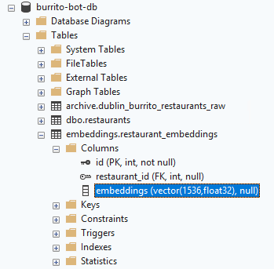
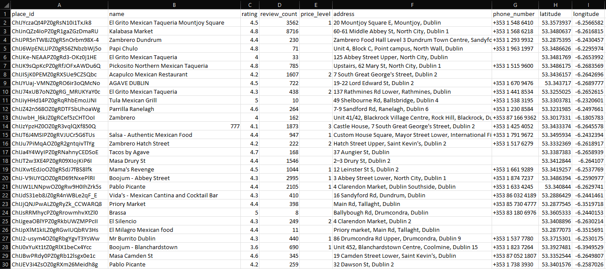
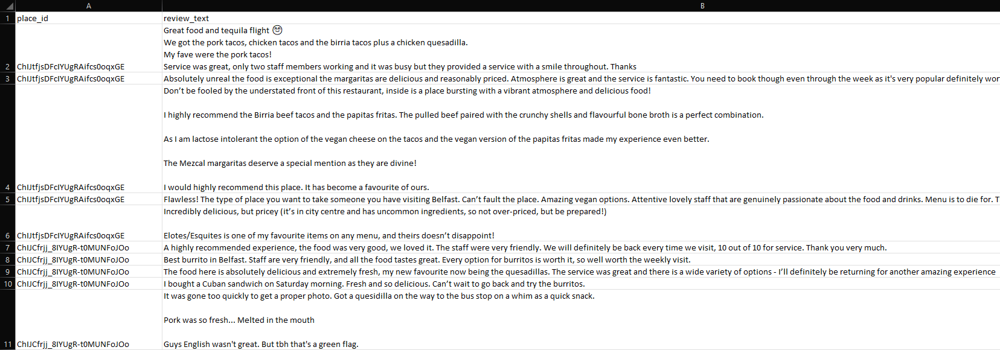
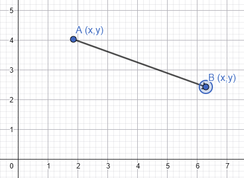
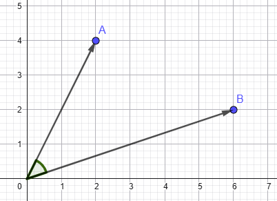
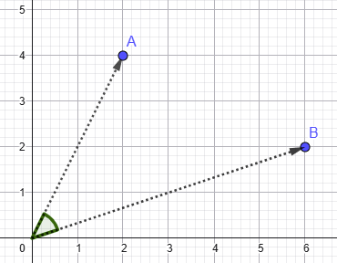
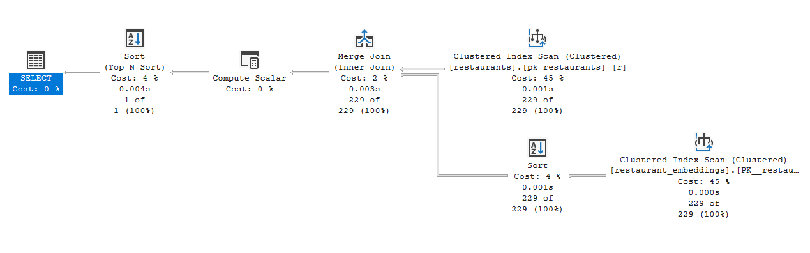
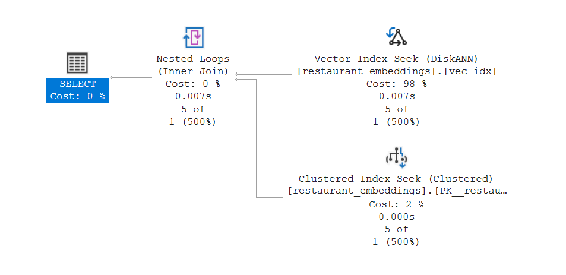

# AI-Powered Search in SQL Server 2025

---

---

## Andrew Pruski

### Principal Field Solutions Architect
#### Microsoft Data Platform MVP 
#### Docker Captain

<!-- .slide: style="text-align: left;"> -->
<i class="fa-brands fa-bluesky"></i><a href="https://bsky.app/profile/dbafromthecold.com">  @dbafromthecold.com</a> 
<i class="fas fa-envelope"></i>  dbafromthecold@gmail.com 
<i class="fab fa-wordpress"></i>  www.dbafromthecold.com 
<i class="fab fa-github"></i><a href="https://github.com/dbafromthecold">  github.com/dbafromthecold</a>

---

## Session Aim
<!-- .slide: style="text-align: left;"> -->
To dive into how AI-Powered Search works in SQL Server 2025
 
 

Starting from the ground up, we'll build an AI-Powered Search tool...

 
 

...to provide burrito recommendations in Ireland!

---

---

## Querying Data
<!-- .slide: style="text-align: left;"> -->
"Find me a restaurant in 
Dublin 
with a 
4 star rating"
  

"Find me a restaurant with a cozy atmosphere"

---

---

## Semantic Similarity Searching
<!-- .slide: style="text-align: left;"> -->
Semantic similarity search finds results with ***similar meaning***, even when the ***exact words*** differ, by comparing ***vector embeddings*** generated from data.

---

## But... how do we store meaning?
<!-- .slide: style="text-align: left;"> -->

<ul>
<li class="fragment">Embeddings!</li>
<li class="fragment">Numerical vectors representing the meaning of data</li>
<li class="fragment">Similar concepts positioned closer in high-dimensional space</li>
<li class="fragment">In SQL Server, they are stored using the VECTOR data type</li>
</ul>

---

## The Vector Data Type in SQL 2025
<!-- .slide: style="text-align: left;" -->

<ul>
  <li>Stored in an optimized binary format</li>
  <li>Displayed as an array of floating point numbers</li>
  <li>Dictated by external model</li>
  <li>Float32 & Float16 supported</li>
</ul>

---

## What are the steps?
<!-- .slide: style="text-align: left;"> -->
<ul>
<li class="fragment">Get raw data</li>
<li class="fragment">Create reference to AI model</li>
<li class="fragment">Generate embeddings</li>
<li class="fragment">Search that data</li>
</ul>

---

## Raw Data
<!-- .slide: style="text-align: left;"> -->

---

## Review Data
<!-- .slide: style="text-align: left;"> -->

---

## Chunking Data
<!-- .slide: style="text-align: left;" -->

Design decisions when creating embeddings:
- What text are we embedding?
- What level of granularity should we use?

Trade-offs:
- Large chunks: embeddings become vague
- Small chunks: loss of context
- More chunks: computationally expensive

---

## Generating Embeddings
<!-- .slide: style="text-align: left;"> -->
<pre><code data-line-numbers="1|2-8|10">CREATE EXTERNAL MODEL [text-embedding-3-small]
WITH (
    LOCATION = 'https://burrito-bot.com/text-embedding-3-small?api-version=2023-05-15',
    API_FORMAT = 'Azure OpenAI',
    MODEL_TYPE = EMBEDDINGS,
    MODEL = 'text-embedding-3-small',
    CREDENTIAL = [https://burrito-bot-ai.openai.azure.com]
);

AI_GENERATE_EMBEDDINGS(@text USE MODEL [text-embedding-3-small])
</pre></code>
 

---

# Demo:
# Generating Embeddings
<!-- .slide: style="text-align: left;"> -->

---

# Comparing vectors
<!-- .slide: style="text-align: left;"> -->

---

## Magnitude
<!-- .slide: style="text-align: left;"> -->

<section>

"I really love burritos"

vs

"I really really really really love burritos"

</section>

---

## Euclidean Distance
<!-- .slide: style="text-align: left;" -->

$$ d(\mathbf{a}, \mathbf{b}) =
  \sqrt{(a_1 - b_1)^2 + (a_2 - b_2)^2 + \dots + (a_n - b_n)^2} $$

- True geometric distance
- Sensitive to magnitude
- 0 = identical vectors

---

## Dot Product
<!-- .slide: style="text-align: left;"> -->

$$
\mathbf{a} \cdot \mathbf{b}
=
\sum_{i=1}^{n} a_i b_i
=
a_1 b_1 + a_2 b_2 + a_3 b_3 + \dots + a_n b_n
$$

- Alignment of vectors
- Scales with magnitude
- 0 = orthogonal vectors

---

## Cosine Similarity
<!-- .slide: style="text-align: left;"> -->

$$
\mathrm{sim}(\mathbf{a}, \mathbf{b})
=
\frac{\mathbf{a} \cdot \mathbf{b}}
     {\Vert \mathbf{a} \Vert \ \Vert \mathbf{b} \Vert}
$$

- Angular similarity
- Scale invariant
- Higher = more similar

---

## Distance metrics
<!-- .slide: style="text-align: left;"> -->

<ul>
  <li class="fragment fade-in-then-semi-out">
    Euclidean &rarr; How far apart are these vectors in space?
  </li>
  <li class="fragment fade-in-then-semi-out">
    Dot Product &rarr; How aligned are they, factoring in magnitude?
  </li>
  <li class="fragment fade-in-then-semi-out">
    Cosine &rarr; How aligned are they, ignoring magnitude?
  </li>
</ul>

---

## Why Cosine Works for Burrito Bot
<!-- .slide: style="text-align: left;"> -->

- Longer restaurant reviews shouldn't automatically rank higher
- We want reviews with similar meaning, not just more words
- Cosine ignores vector length and compares semantic direction

---

## Normalised vectors
<!-- .slide: style="text-align: left;"> -->
- Vectors scaled so their magnitude = 1
- Dot product = Cosine
- Euclidean distance produces the same ranked results

---

## Exact Search
<!-- .slide: style="text-align: left;"> -->
<ul>
  <li>K-nearest neighbour search (k-NN)</li>
  <li>Calculates distance between the search vector and every other row</li>
  <li>Selects the closest neighbours based on a specific distance metric</li>
  <li>Computationally expensive</li>
  <li class="fragment fade-in">Table scans!</li>
</ul>

---

## Vector Distance
<!-- .slide: style="text-align: left;"> -->
<pre><code data-line-numbers="1-2|2|4-15|13|16">DECLARE @search_text NVARCHAR(MAX) = 'Find me a restaurant with a great atmosphere';
DECLARE @search_vector VECTOR(1536) = AI_GENERATE_EMBEDDINGS(@search_text USE MODEL [text-embedding-3-small]);

SELECT TOP(1)
	r.[id], 
	r.[name], 
	r.[city], 
	r.[rating], 
	r.[review_count], 
	r.[address], 
	r.[phone], 
	r.[url],
	vector_distance('cosine', @search_vector, e.embeddings) AS distance
FROM [dbo].[restaurants] r
INNER JOIN [embeddings].[restaurant_embeddings] e ON r.id = e.restaurant_id
ORDER BY distance;
GO
</pre></code>

---

## Vector Distance
<!-- .slide: style="text-align: left;"> -->

---

# Demo:
# Exact Search
<!-- .slide: style="text-align: left;"> -->

---

# Indexing vectors
<!-- .slide: style="text-align: left;"> -->

---

## Approximate Search
<!-- .slide: style="text-align: left;"> -->
- Exact k-NN search does not scale for large vector datasets
- Approximate Nearest Neighbor (ANN) improves speed dramatically
- Trades a small amount of accuracy for major performance gains
- Accuracy measured by recall (how close results are to exact search)
- ANN requires a vector index
- SQL vector indexes are based on DiskANN

---

## DiskANN
<!-- .slide: style="text-align: left;"> -->
- Graph-based index connecting similar vectors
- Finds neighbors by traversing graph paths instead of scanning all data
- Built for large-scale vector datasets
- Uses SSD + minimal memory efficiently
- Provides:
  - High queries-per-second (QPS)
  - Low latency
  - Balanced CPU, memory, and I/O usage

---

## Vector Indexes
<!-- .slide: style="text-align: left;"> -->
<pre><code data-line-numbers="1-6|3|4|5">CREATE VECTOR INDEX vec_idx ON [embeddings].[restaurant_embeddings]([embeddings])
WITH (
    metric = 'cosine',
    type = 'diskann',
    maxdop = 8
);</pre></code>

---

## Things to be aware of!
<!-- .slide: style="text-align: left;"> -->

<ul>
  <li>Requires preview features to be enabled</li>
  <li>Vector indexes set a table to read only</li>
  <li>Requires a single column, integer, clustered primary key</li>
  <li>No replication to subscribers</li>
  <li class="fragment fade-in">MAXDOP is ignored (currently, see SQL 2025 known issues)</li>
</ul>

---

## Vector Search
<!-- .slide: style="text-align: left;"> -->
<pre><code data-line-numbers="1-13|1-2|4-13|7|8|9|10|11|12">DECLARE @search_text NVARCHAR(MAX) = 'Find me a restaurant with a great atmosphere';
DECLARE @search_vector VECTOR(1536) = AI_GENERATE_EMBEDDINGS(@search_text USE MODEL [text-embedding-3-small]);

SELECT
    restaurant_id,
    distance
FROM vector_search(
    TABLE      = [embeddings].[restaurant_embeddings],
    COLUMN     = [embeddings],
    SIMILAR_TO = @search_vector,
    METRIC     = 'cosine',
    TOP_N      = 5
)
</pre></code>

---

## Vector Search
<!-- .slide: style="text-align: left;"> -->

---

# Demo:
# Approximate Search
<!-- .slide: style="text-align: left;"> -->

---

## Resources
<!-- .slide: style="text-align: left;"> -->

<a href="https://github.com/dbafromthecold/aipoweredsearch">https://github.com/dbafromthecold/aipoweredsearch</a> 

